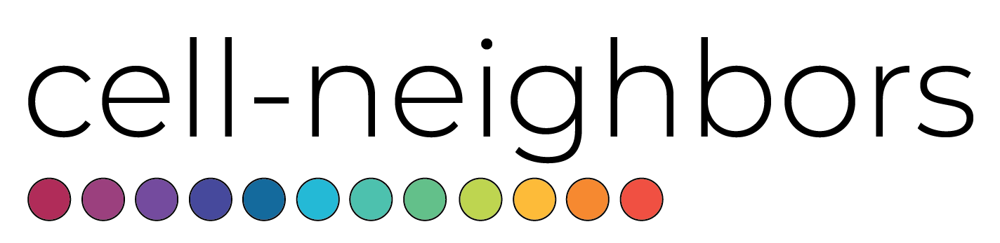
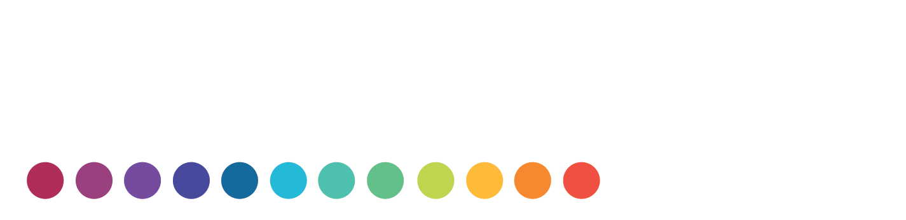

.. title:: cell-neighbors

.. raw:: html

    <embed>
        

         
         
         
        

    </embed>

    

.. toctree::
   :hidden:
   
   quickstart
   install
   api
   examples

.. grid:: 4
   :gutter: 1
   :class-container: only-light

   .. grid-item-card::
      :link: quickstart.rst
      :text-align: right
      :img-background: _static/cell_neighbors-sd-card-light.png
      :class-card: only-light
       
      Quickstart
      ^^^
       
      .. raw:: html

         <embed>
  
</embed>

      :octicon:`flame;3em;sd-text-dark`
       
   .. grid-item-card::
      :link: install.rst
      :text-align: right
      :img-background: _static/cell_neighbors-sd-card-light.png
      :class-card: only-light
       
      Installation
      ^^^
       
      .. raw:: html

         <embed>
  
</embed>

      :octicon:`desktop-download;3em;sd-text-dark`

   .. grid-item-card::
      :link: api.rst
      :text-align: right
      :img-background: _static/cell_neighbors-sd-card-light.png
      :class-card: only-light
       
      API Reference
      ^^^
       
      .. raw:: html

         <embed>
  
</embed>

      :octicon:`code;3em;sd-text-dark`

   .. grid-item-card::
      :link: examples.rst
      :text-align: right
      :img-background: _static/cell_neighbors-sd-card-light.png
      :class-card: only-light
       
      Examples
      ^^^
       
      .. raw:: html

         <embed>
  
</embed>

      :octicon:`sidebar-expand;3em;sd-text-dark`

.. grid:: 4
   :gutter: 1
   :class-container: only-light

   .. grid-item-card::
      :link: https://github.com/mvinyard/cell-neighbors
      :text-align: right
      :img-background: _static/cell_neighbors-sd-card-light.png
      :class-card: only-light
       
      GitHub
      ^^^
       
      .. raw:: html

         <embed>
  
</embed>

      :octicon:`mark-github;3em;sd-text-dark`

.. grid:: 4
   :gutter: 1
   :class-container: only-dark

   .. grid-item-card::
      :link: quickstart.rst
      :text-align: right
      :img-background: _static/cell_neighbors-sd-card-dark.png
      :class-card: only-dark
       
      Quickstart
      ^^^
       
      .. raw:: html

         <embed>
  
</embed>

      :octicon:`flame;3em;sd-text-light`
       
   .. grid-item-card::
      :link: install.rst
      :text-align: right
      :img-background: _static/cell_neighbors-sd-card-dark.png
      :class-card: only-dark
       
      Installation
      ^^^
       
      .. raw:: html

         <embed>
  
</embed>

      :octicon:`desktop-download;3em;sd-text-light`

   .. grid-item-card::
      :link: api.rst
      :text-align: right
      :img-background: _static/cell_neighbors-sd-card-dark.png
      :class-card: only-dark
       
      API Reference
      ^^^
       
      .. raw:: html

         <embed>
  
</embed>

      :octicon:`code;3em;sd-text-light`

   .. grid-item-card::
      :link: examples.rst
      :text-align: right
      :img-background: _static/cell_neighbors-sd-card-dark.png
      :class-card: only-dark
       
      Examples
      ^^^
       
      .. raw:: html

         <embed>
  
</embed>

      :octicon:`sidebar-expand;3em;sd-text-light`

.. grid:: 4
   :gutter: 1
   :class-container: only-dark

   .. grid-item-card::
      :link: https://github.com/mvinyard/cell-neighbors
      :text-align: right
      :img-background: _static/cell_neighbors-sd-card-dark.png
      :class-card: only-dark
       
      GitHub
      ^^^
       
      .. raw:: html

         <embed>
  
</embed>

      :octicon:`mark-github;3em;sd-text-light`

.. raw:: html

   <embed>
      

           
           
      

   </embed>
